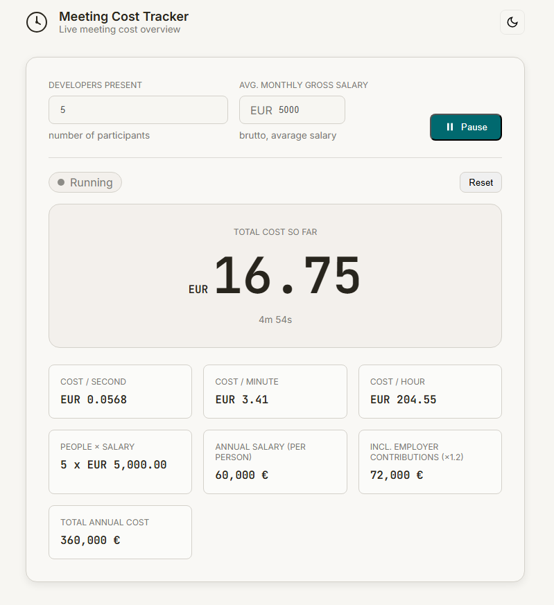

# 💰 Meeting Cost Tracker

> A small single-page tool that shows, **in real time**, how much a meeting is costing while it runs. 💸

It is intentionally simple: enter how many developers are present, enter the average monthly gross salary, press **Start**, and the page begins counting the cost every second. ⏱️



---

## 🚀 Quick start

Open the tracker in your browser. The project is published via GitHub Pages — live demo URLs:

- 🇬🇧 English UI: https://skoelle.github.io/PeopleCostCounter/meeting-tracker-en.html
- 🇩🇪 German UI:  https://skoelle.github.io/PeopleCostCounter/meeting-tracker-de.html

You can also open the local HTML files directly in a browser (no build step required). Recommended browsers: Chrome, Edge, Firefox.

If you prefer a live-reload development workflow, use an editor extension such as Live Server (VS Code) or any simple static file server.

---

## 🎮 Controls

| Button    | Action |
|-----------|--------|
| ▶️ **Start**   | Begins the live counter at zero. |
| 🔄 **Reset**   | Stops the counter and sets the accumulated cost back to zero. |

The cost per second recalculates when inputs change; the accumulated cost updates once per second while running.

---

## 📁 Files of interest

| File | Description |
|------|-------------|
| `meeting-tracker-de.html` | 🇩🇪 Canonical build — German UI |
| `meeting-tracker-en.html` | 🇬🇧 Canonical build — English UI |

### 🧪 Experimental variants (in `variants/`)

- `meeting-tracker-variant1.html`
- `meeting-tracker-variant2.html`
- `meeting-tracker-variant3.html`

---

## 🌐 Browser & dependencies

- ✅ No build tool or runtime dependencies — only vanilla HTML/CSS/JS.
- 🔤 Google Fonts are used for typography (Inter / JetBrains Mono); pages work fine if fonts are blocked.

---

## 🧮 Example (quick test)

| Input | Value |
|-------|-------|
| 👥 Developers | `8` |
| 💶 Avg. monthly salary | `5000` |

**Expected output:**

- 📊 Annual per-dev = `60.000 €`
- 🏢 incl. employer ≈ `72.000 €`
- 🧾 Total for 8 ≈ `576.000 €`
- ⏱️ Cost/sec ≈ `0.0909 €`
- 💣 After 60s ≈ `5,45 €`

---

## 🔍 What it calculates

The tracker estimates meeting cost from salary, employer overhead, team size, and elapsed time. The calculation is based on the idea that one developer's salary can be converted into an annual employer cost, then into a working-hour and working-second cost.

Similar meeting-cost tools commonly start from annual salary, convert it to an hourly rate, and multiply by meeting duration and headcount. 📐

> 🔗 [meetingtoll.com — Meeting cost formula per employee](https://www.meetingtoll.com/blog/meeting-cost-formula-per-employee)

### 📝 Formula

```
AnnualSalary                = AvgMonthlySalary × 12
AnnualSalaryWithEmployer    = AnnualSalary × 1.2
TotalAnnualCost             = AnnualSalaryWithEmployer × DevelopersPresent
CostPerSecond               = TotalAnnualCost ÷ 220 ÷ 8 ÷ 60 ÷ 60
```

The **1.2 multiplier** is a simplified overhead factor for employer contributions (~20% above gross salary). 📈

> 🔗 [boundlesshq.com — Payroll in Germany](https://boundlesshq.com/blog/payroll-in-germany/)

### 🗓️ Why 220 days?

The app divides by **220 working days** instead of 365 calendar days — making the result closer to actual working time, because meetings happen during paid work, not across the full calendar year. 🏖️

> 🔗 [capme.app — Meeting Cost Calculator](https://www.capme.app/meeting-cost-calculator)

Using 220 days, 8 hours per day, and 60 minutes per hour is a practical simplification that turns annual cost into a live per-second burn rate. It is not a payroll-grade accounting model, but it is a useful way to visualize meeting cost in real time.

> 🔗 [meetingking.com — Meeting Cost Calculator](https://meetingking.com/meeting-cost-calculator/)

---

## 📌 Notes

This tool is designed to make meeting costs **visible**, not to produce exact payroll accounting. In real companies, the true employer cost can vary by insurance rates, caps, bonuses, and other overhead — so the 1.2 factor should be understood as a simple approximation. 🤏

> 🔗 [payrollgermany.de — Employer contributions in Germany](https://payrollgermany.de/blog/employer-contributions-to-social-security-in-germany-a-comprehensive-guide/)

The result is best used as a **conversation starter**: it helps teams notice how quickly meeting time turns into money. 💡

---

## 🤝 Contributing

- 🌿 Prefer small, focused pull requests.
- 🏷️ Create a branch named `feature/...` or `fix/...` for changes.
- 📩 If you want me to push changes, tell me whether to create a PR or commit directly to `main`.

---

## 📄 License

Licensed under the [MIT License](LICENSE) — Copyright (c) 2026 Stefan Koelle (https://stefankoelle.de)

---

<p align="center">
  Made with ❤️ for better meetings
</p>
